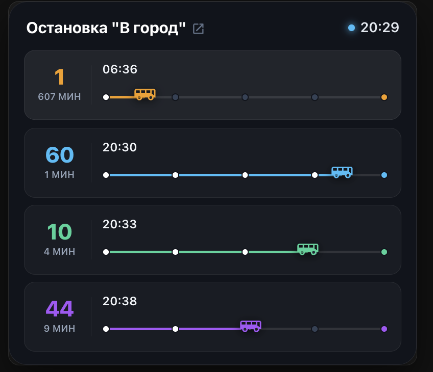
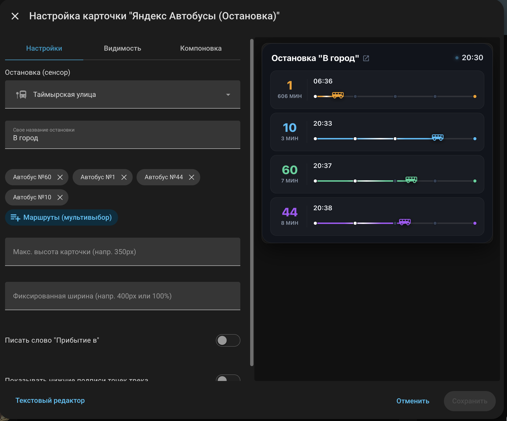

# Yandex Bus Card для Home Assistant

Кастомная карточка Lovelace в стиле современного темного неоморфизма (glassmorphism) для отображения живого расписания общественного транспорта от Яндекса с анимированными шкалами движения и интерактивным редактором.

## Внешний вид
Вот так карточка выглядит на дашборде (отображение маршрутов, таймлайнов движения и бегущих иконок автобусов):

## Настройка
Карточка полностью поддерживает нативный визуальный редактор Home Assistant. Вы можете выбрать сенсор остановки, отфильтровать нужные маршруты через удобный мультивыбор, а также настроить размеры и отображение текста:

## Возможности
- **Живое табло остановки** с крупными номерами маршрутов и временем прибытия.
- **Анимированный трек движения** с бегущим световым импульсом и наглядными точками маршрута.
- **Интерактивный визуальный редактор** с автоопределением доступных маршрутов.
- **Тонкая кастомизация**: настройка высоты, ширины и текстовых префиксов.
- **Встроенные часы** в реальном времени с индикатором работы.

## Установка через HACS
1. Откройте **HACS** в вашем Home Assistant.
2. Перейдите в раздел **Frontend**.
3. Нажмите на три точки в правом верхнем углу и выберите **Пользовательские репозитории** (Custom repositories).
4. Вставьте ссылку на этот репозиторий (`https://github.com/Gakuzi/yandex-bus-card`), в категории выберите **Lovelace** и нажмите **Добавить**.
5. Найдите **Yandex Bus Card** в списке и нажмите **Установить**.
